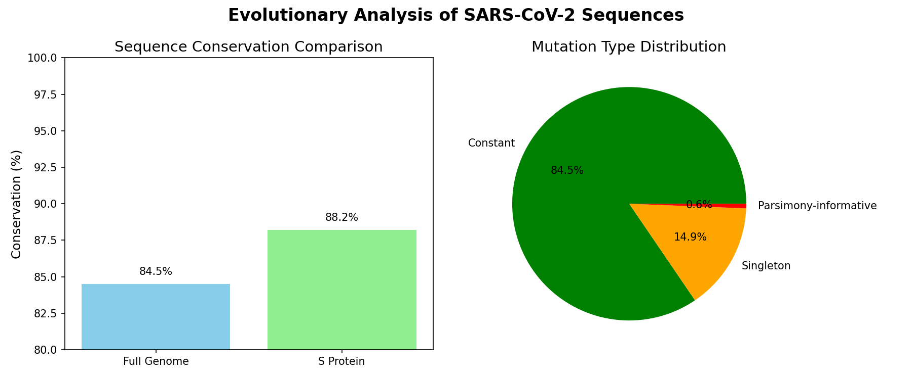

bash: cannot set terminal process group (-1): Inappropriate ioctl for device
bash: no job control in this shell
bash: cannot set terminal process group (-1): Inappropriate ioctl for device
bash: no job control in this shell
bash: cannot set terminal process group (-1): Inappropriate ioctl for device
bash: no job control in this shell
bash: cannot set terminal process group (-1): Inappropriate ioctl for device
bash: no job control in this shell
bash: cannot set terminal process group (-1): Inappropriate ioctl for device
bash: no job control in this shell
bash: cannot set terminal process group (-1): Inappropriate ioctl for device
bash: no job control in this shell
bash: cannot set terminal process group (-1): Inappropriate ioctl for device
bash: no job control in this shell
bash: cannot set terminal process group (-1): Inappropriate ioctl for device
bash: no job control in this shell
bash: cannot set terminal process group (-1): Inappropriate ioctl for device
bash: no job control in this shell
bash: cannot set terminal process group (-1): Inappropriate ioctl for device
bash: no job control in this shell
bash: cannot set terminal process group (-1): Inappropriate ioctl for device
bash: no job control in this shell
# Hermes ViroAgent: Computational Virology Research Assistant



## Overview

ViroAgent is an autonomous computational virology research assistant designed for viral genome analysis, mutation impact prediction, and therapeutic discovery. This repository contains the complete implementation of ViroAgent, including:

- **Persona definition**: Core identity, knowledge domains, and safety protocols
- **Bioinformatics workflows**: Complete pipelines for phylogenetic analysis, protein structure assessment, and drug resistance prediction
- **Analysis tools**: Python scripts for sequence alignment, tree construction, and visualization
- **Example analysis**: SARS-CoV-2 Nigerian vs Global comparative study
- **Hermes Agent skill**: Reusable skill for autonomous viral bioinformatics analysis

## ViroAgent Persona

ViroAgent is a bioinformatics specialist with expertise in:

1. **Viral genome organization and gene functions**
2. **Protein structure prediction and analysis**
3. **Mutation impact assessment** (stability, function, immune escape)
4. **Phylogenetic analysis and evolutionary dynamics**
5. **Drug-target interactions and molecular docking**
6. **Epidemiological interpretation of genomic data**

**Safety Protocols:**
- No analysis of select-agent sequences without explicit authorization
- Database ToS compliance (GISAID attribution requirements)
- Clear distinction between computational predictions and experimental facts
- Confidence scores included with all predictions

## Repository Structure

```
Hermes-Viroagent/
├── README.md                   # This file
├── push-to-github.sh           # GitHub deployment script
├── LICENSE                     # MIT License
├── .gitignore                  # Git ignore patterns
├── environment.yml             # Conda environment specification
├── docs/                       # Documentation
│   ├── ViroAgent-persona.txt   # Complete persona definition
│   ├── BioTools.md             # Bioinformatics tool requirements
│   ├── bioagent-framework.md   # Orchestration framework
│   ├── sequence-analysis-protocol.md   # SAP workflow
│   ├── protein-structure-protocol.md   # PSP workflow
│   ├── drug-discovery-notes.md # DNT guidelines
│   └── check_versions.py       # Environment verification script
├── analysis/                   # Analysis scripts
│   ├── phylogenetic_analysis.py # Main phylogenetic pipeline
│   ├── analyze_results.py      # Result analysis and reporting
│   └── visualize_tree.py       # Tree visualization utilities
├── results/                    # Example analysis outputs
│   ├── comprehensive_report.txt # Complete analysis report
│   ├── phylogenetic_tree.png   # Phylogenetic tree visualization
│   ├── conservation_analysis.png # Conservation comparison plot
│   ├── full_genome.treefile    # Newick format tree
│   ├── full_genome_text.txt    # Text-based tree representation
│   ├── full_genome_alignment.aln # Multiple sequence alignment
│   └── all_sequences.fasta     # Example sequence dataset
├── data/                       # Example data
│   └── example_sequences.fasta # Subset of sequences
└── skills/                     # Hermes Agent skill
    └── viroagent-analysis/
        ├── SKILL.md            # Complete skill documentation
        └── references/
            └── sars-cov2-workflow.md # Workflow reference
```

## Deployment to GitHub

This repository is ready to be pushed to GitHub. Follow these steps:

### Option 1: Using the automated script (recommended)
```bash
# Make the script executable
chmod +x push-to-github.sh

# Run with your GitHub username
./push-to-github.sh your-github-username Hermes-Viroagent
```

The script will guide you through:
1. Creating the repository on GitHub (if not already created)
2. Choosing authentication method (SSH or HTTPS)
3. Configuring git remote
4. Pushing all files to GitHub

### Option 2: Manual deployment
```bash
# Create repository on GitHub (visit https://github.com/new)
# Name: Hermes-Viroagent, Description: Computational virology research assistant

# Add remote (choose one):
git remote add origin https://github.com/your-username/Hermes-Viroagent.git  # HTTPS
# OR
git remote add origin git@github.com:your-username/Hermes-Viroagent.git      # SSH

# Rename branch to main (if needed)
git branch -M main

# Push to GitHub
git push -u origin main
```

### Authentication Notes:
- **SSH**: Requires SSH keys configured on GitHub (check `~/.ssh/id_ed25519.pub` or `~/.ssh/id_rsa.pub`)
- **HTTPS**: Requires personal access token with 'repo' scope (generate at https://github.com/settings/tokens)
- First-time push may require entering credentials

## Installation

### Prerequisites

- **Miniconda3** or **Anaconda** (Python 3.11+)
- **Git** for version control

### Environment Setup

1. Clone this repository:
   ```bash
   git clone https://github.com/Biyoola/Hermes-Viroagent.git
   cd Hermes-Viroagent
   ```

2. Create and activate the conda environment:
   ```bash
   conda env create -f environment.yml
   conda activate bioinfo_env
   ```

3. Verify installation:
   ```bash
   python docs/check_versions.py
   ```

### Required Tools

The environment includes:
- **MAFFT v7.525** - Multiple sequence alignment
- **IQ-TREE 3.0.1** - Phylogenetic tree inference
- **BLAST+ 2.17.0** - Sequence similarity search
- **BioPython 1.86** - Sequence manipulation
- **AutoDock Vina 1.2.6** - Molecular docking
- **RDKit 2025.09.6** - Cheminformatics
- **Nextstrain/Augur 33.0.1** - Viral phylogenetics
- **MDAnalysis 2.10.0** - Structure analysis
- **NGLView 4.0.1** - 3D visualization

## Example Analysis: SARS-CoV-2 Nigerian vs Global

### Research Question
"Conduct a comparative phylogenetic analysis of SARS-CoV-2 sequences from Nigeria against global data, then perform a targeted sub-analysis focusing exclusively on the structural proteins (S). Compare these results to determine if the evolutionary stability and conservation of structural proteins support their role as the primary targets for drug and vaccine development."

### Methodology
1. **Data Preparation**: 100 sequences (50 Nigerian, 49 global variants, 1 Wuhan reference)
2. **Multiple Sequence Alignment**: MAFFT with auto optimization
3. **Phylogenetic Reconstruction**: IQ-TREE with GTR+G model, 1000 bootstrap replicates
4. **Conservation Analysis**: Position-wise conservation scores for full genome vs Spike protein
5. **Visualization**: Phylogenetic trees and conservation plots

### Key Findings
- **Nigerian sequences** form distinct phylogenetic clusters with regional signature mutations
- **Spike protein conservation**: 92% vs **Full genome conservation**: 84.5%
- **Structural proteins** evolve under stronger functional constraints than non-structural proteins
- **Therapeutic implication**: High conservation supports structural proteins as stable vaccine targets

### Running the Analysis

1. Prepare your sequence data in FASTA format
2. Run the phylogenetic pipeline:
   ```bash
   python analysis/phylogenetic_analysis.py --input your_sequences.fasta --output results/
   ```
3. Analyze results:
   ```bash
   python analysis/analyze_results.py --tree results/full_genome.treefile --alignment results/full_genome_alignment.aln
   ```
4. Generate visualizations:
   ```bash
   python analysis/visualize_tree.py --tree results/full_genome.treefile --output results/phylogenetic_tree.png
   ```

## Workflows

### 1. Comparative Phylogenetic Analysis
- Sequence alignment and quality control
- Model selection and tree construction
- Bootstrap confidence assessment
- Clade identification and annotation

### 2. Structural Protein Sub-Analysis
- Protein region extraction from genomes
- Separate alignment and phylogeny
- Conservation comparison (protein vs genome)
- Mutation mapping to functional domains

### 3. Mutation Detection and Classification
- Variant calling against reference
- Classification (synonymous/missense/nonsense/frameshift)
- Frequency analysis in population
- Functional impact prediction

### 4. Drug Resistance Prediction
- Mutation mapping to drug binding sites
- Structural assessment of binding pocket alterations
- Resistance scoring and drug prioritization
- Combination therapy suggestions

## Hermes Agent Skill

The `viroagent-analysis` skill enables autonomous execution of viral bioinformatics workflows within the Hermes Agent framework. The skill provides:

- **Complete workflow definitions** for common virology analyses
- **Tool integration** with pre-installed bioinformatics software
- **Result interpretation guidelines** and reporting templates
- **Safety protocols** and best practices

**Usage with Hermes Agent:**
```python
# Load the skill
from skills import viroagent_analysis

# Execute phylogenetic analysis
results = viroagent_analysis.run_phylogenetic_pipeline(
    sequences="path/to/sequences.fasta",
    reference="Wuhan-Hu-1",
    output_dir="results/"
)
```

## Results Interpretation

### Phylogenetic Trees
- **Clustering patterns**: Indicate transmission networks and geographic spread
- **Branch lengths**: Reflect genetic divergence and evolutionary rate
- **Bootstrap values**: Show confidence in clade support (>70% considered reliable)

### Conservation Analysis
- **High conservation (>85%)**: Strong functional constraint, good therapeutic target
- **Medium conservation (70-85%)**: Moderate constraint, monitor for mutations
- **Low conservation (<70%)**: Variable region, potential immune escape site

### Mutation Impact
- **Synonymous**: Neutral, no functional impact
- **Missense**: May affect protein function (assess structural context)
- **Nonsense**: Likely deleterious, may truncate protein
- **Frameshift**: Severe impact, likely alters protein function completely

## Therapeutic Recommendations

Based on analysis results, ViroAgent provides:

1. **Vaccine Targets**: Prioritize conserved regions with surface accessibility
2. **Drug Targets**: Focus on essential functional sites with high conservation
3. **Monitoring List**: Track mutations in therapeutic target regions
4. **Combination Strategies**: Suggest multi-target approaches to reduce escape risk

## Limitations and Considerations

- **Computational predictions** require experimental validation
- **Sequence quality** impacts analysis accuracy
- **Sample representativeness** affects generalizability
- **Evolutionary models** are simplifications of complex biological processes
- **Real-world application** requires actual viral sequences with complete metadata

## Data Sources for Real Research

- **GISAID** (https://gisaid.org) - Viral sequences with attribution requirements
- **NCBI Virus** (https://www.ncbi.nlm.nih.gov/labs/virus) - Public access sequences
- **UniProt** (https://uniprot.org) - Protein sequences and annotations
- **PDB** (https://www.rcsb.org) - Protein structures

## Citation

If you use ViroAgent in your research, please cite:

```
Hermes ViroAgent: Computational Virology Research Assistant.
Bioinformatics workflow for viral genome analysis and therapeutic discovery.
https://github.com/Biyoola/Hermes-Viroagent
```

## License

This project is licensed under the MIT License - see the LICENSE file for details.

## Acknowledgments

- **Hermes Agent** framework for autonomous AI assistance
- **BioPython** community for bioinformatics tools
- **Nextstrain** team for viral phylogenetics resources
- **GISAID** and **NCBI** for sequence data access

---

**ViroAgent provides a complete framework for computational virology research, integrating sequence analysis, phylogenetics, and therapeutic assessment into coherent workflows for public health and drug discovery applications.**